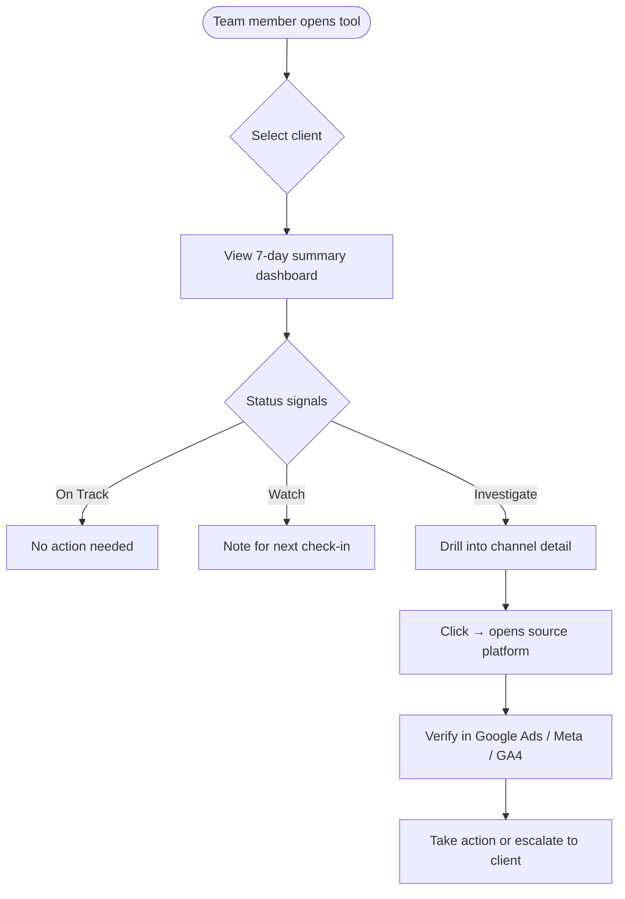
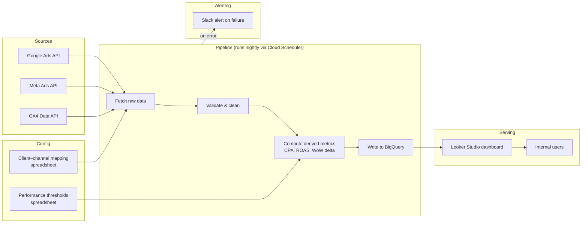
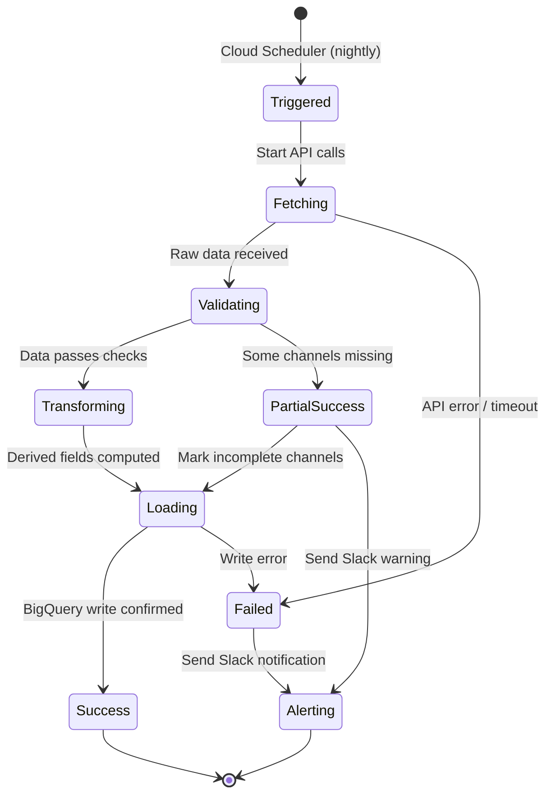

# Flow Diagrams

## 1. User Flow



---

## 2. Data Flow



---

## 3. Pipeline State Machine



---

## 4. Dashboard Layout (Wireframe Sketch)

```
┌─────────────────────────────────────────────────────┐
│  [Client Name ▼]          Last updated: Mon 09:02   │
├─────────────┬─────────────┬─────────────┬───────────┤
│  SPEND      │  CONVERSIONS│  CPA        │  ROAS     │
│  £12,400    │  348        │  £35.63     │  3.2x     │
│  ▲ +8% WoW  │  ▼ -4% WoW  │  ▲ +12% WoW │  ▼ -3%   │
├─────────────┴─────────────┴─────────────┴───────────┤
│  CHANNEL BREAKDOWN                                  │
│  ┌──────────────┬────────┬──────┬───────┬────────┐  │
│  │ Channel      │ Spend  │ Conv │ CPA   │ Status │  │
│  ├──────────────┼────────┼──────┼───────┼────────┤  │
│  │ Google Ads   │ £7,200 │ 210  │£34.28 │ ✅     │  │
│  │ Meta Ads     │ £5,200 │ 138  │£37.68 │ ⚠️     │  │
│  └──────────────┴────────┴──────┴───────┴────────┘  │
│                                                     │
│  ⚠️  OBSERVATION: Meta CPA up 18% vs prior week.    │
│     Highest in last 30 days. Review ad creative.    │
└─────────────────────────────────────────────────────┘
```
